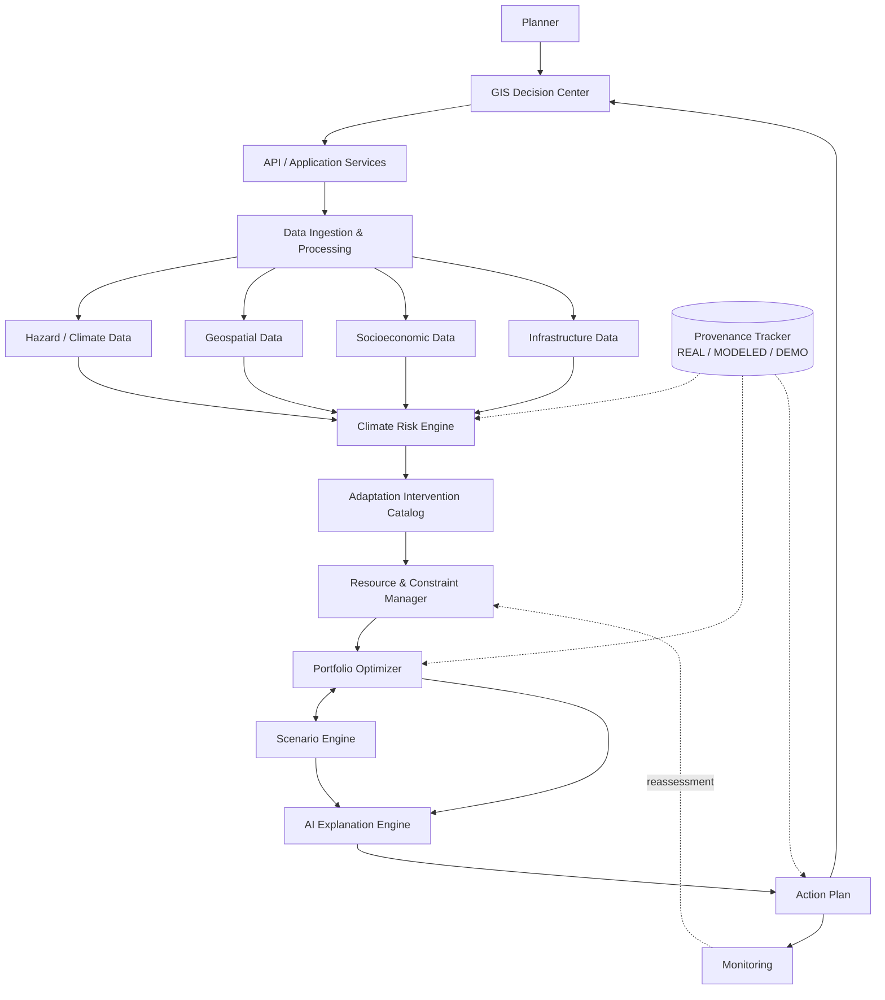

# Climora

**Intelligent Climate Adaptation Platform — from climate risk to an implementable adaptation plan.**

> Climora is built for cities that already know they're at risk but don't know what to do about it under real budgets, land, water, and time limits. It computes localized climate risk from real hazard science, runs a constraint-validated optimizer to select a fundable intervention portfolio, lets a planner explore what-if scenarios, and explains every result in plain language — without ever letting an AI invent a risk, cost, or effectiveness number.
>
> **AGNITIA'26, 36-Hour National Level Hackathon — Prestige Institute of Engineering Management and Research (PIEMR), Indore.**

---

## What it does

A planner (municipal authority, disaster-management officer, urban planner) opens the GIS Decision Center for their city and:

1. **Sees localized climate risk** — hazard × exposure × vulnerability, computed by the Climate Risk Engine, not asserted by an AI.
2. **Specifies real-world constraints** — budget, land, water, workforce, implementation deadline, planning priority.
3. **Gets a resource-constrained adaptation portfolio** — the Optimizer selects interventions (cool roofs, urban trees, cooling centers, etc.) that fit within hard limits, never violating them.
4. **Explores what-if scenarios** — change the budget, the planning horizon, or the priority, and see how the portfolio changes and why.
5. **Asks the AI Advisor "why"** — "Why was this ward prioritized?", "Why were cool roofs selected over trees?" — answered from the system's own structured outputs, never invented.
6. **Exports an Action Plan** — location, intervention, cost, timeline, responsible department, monitoring indicators.
7. **Monitors implementation** — progress feeds back into reassessment, closing the loop.

---

## Architecture



The Optimizer **proposes; it never persists directly.** Every optimizer output passes through a Constraint Validator before it's saved or returned — the only path from "a portfolio was computed" to "a plan exists" is structural, not conventional. The AI Explanation Engine sits downstream of everything: it reads already-persisted structured outputs and explains them, but never computes a risk, cost, or effectiveness value itself.

Full architecture (all 12 components, data flows, ADRs): `docs/architecture.md`. ADRs alone: `docs/decisions.md`.

---

## Tech stack

| Layer | Choice |
|---|---|
| Frontend | Next.js, TypeScript, Tailwind CSS, MapLibre, Recharts |
| Backend | Python, FastAPI, Pydantic |
| Scientific / geospatial | CLIMADA (reference methodology), GeoPandas, Rasterio, Shapely, NumPy, SciPy |
| Optimization | OR-Tools / PuLP (MILP) |
| Database | PostgreSQL + PostGIS |
| AI | LLM API — explanation/report generation only, never risk computation |
| Infrastructure | Docker |

**Config, not code, for anything scientific or financial.** Hazard thresholds (`config/hazards.yaml`), intervention costs (`config/interventions.yaml`), and optimization objective weights (`config/optimization.yaml`) are never hardcoded — changing an assumption is a config edit, not a rewrite.

---

## MVP demo workflow

The entire hackathon-critical scope, Indore + extreme heat.

| | Workflow | Modules used | Proves |
|---|---|---|---|
| **A** | Ward risk view → constraint-validated plan | Risk Engine → Constraint Manager → Optimizer | A portfolio can never violate a hard budget/land/time limit |
| **B** | Scenario comparison (e.g. ₹2 crore vs ₹5 crore) | Scenario Engine → Optimizer | Changing one assumption visibly changes the recommended portfolio, with the diff explained |
| **C** | AI Advisor "why was this selected?" query | AI Explanation Engine | Every explanation is grounded in a structured optimizer/risk output — never a hallucinated number |
| **D** | Provenance check on any dashboard value | Provenance Tracker | Every value is traceable to a dataset, version, and REAL/MODELED/DEMO tag |

Recommended demo order: **A → B → C**, keep **D** visible throughout (e.g. as a badge/tooltip on every stat).

---

## Repository layout

```
Climora/
├── README.md               ← you are here
├── AGENTS.md               ← context for AI coding agents
├── docs/                   ← full architecture, ADRs, per-domain design docs
│   ├── project-context.md  ← read first
│   ├── architecture.md     ← full system design
│   ├── decisions.md        ← ADRs — don't relitigate
│   └── ...                 ← climate-risk-engine.md, optimization.md, ai-advisor.md, etc.
├── backend/                 ← FastAPI; domain/ organized by the risk→decision chain
├── frontend/                ← Next.js dashboards (risk, planner, scenario, advisor, plan, monitoring)
├── config/                  ← hazards.yaml, interventions.yaml, optimization.yaml, ai.yaml
├── data/                    ← raw/, processed/, boundaries/, artifacts/
├── notebooks/                ← exploratory science + optimization validation
├── scripts/                  ← ingestion, seeding, MVP run scripts
├── tests/                    ← unit, integration, api, geospatial, risk, optimization, scenarios
├── docker/
└── api_testing/
```

---

## Quickstart (after implementation lands)

```bash
git clone <repo>
cd Climora
cd backend && pip install -r requirements.txt && cd ..
cd frontend && npm install && cd ..

# every session
cd backend && uvicorn main:app --host 127.0.0.1 --port 8000   # terminal 1
cd frontend && npm run dev                                    # terminal 2

# verify
curl http://127.0.0.1:8000/api/v1/health
```

Full deployment details: `docs/deployment.md`.

---

## Data integrity & constraint enforcement

Five enforcement layers, not one:

1. **Ingestion** — every dataset is tagged with source, version, spatial/temporal resolution, and processing status before any domain module can use it.
2. **Provenance Tracker** — every derived value (risk, exposure, vulnerability, optimization result) references the provenance record(s) it was computed from.
3. **Data-class tagging** — every derived value carries `REAL`, `MODELED`, or `DEMO`; nothing modeled is ever presented as measured.
4. **Constraint Validator** — the only path by which an optimizer result is persisted or returned; a portfolio that violates a hard budget/land/water/workforce/time limit is rejected and logged, never rounded or fixed up to pass.
5. **AI grounding** — the Explanation Engine reads only already-persisted structured outputs; if a question needs a number the data doesn't have, it says so instead of estimating.

A dashboard badge shows the data-class of whatever's on screen, so a planner never mistakes a modeled placeholder for a measured fact. Full detail: `docs/data-provenance.md`.

---

## Status

| Phase | State |
|---|---|
| Phase 1 — Architecture | **Drafted** — see `docs/architecture.md` |
| Phase 2 — Tech/model selection | **Drafted** — stack above, config-driven, swappable without a rewrite |
| Phase 3 — Documentation | **In progress** — this repo |
| Phase 4 — Implementation | **Not started** |

"Drafted" means the design is written and internally consistent — not that it's been reviewed, tested, or frozen. Treat it as a starting point to challenge, not a locked spec.

---

## Reading order

If you're new to this codebase:

1. `AGENTS.md` — if you're an AI session, or skip to step 2 if you're a human.
2. `docs/project-context.md` — start here, always.
3. `docs/requirements.md` — MVP scope, Indore/heat boundary.
4. `docs/architecture.md` — the full system design.
5. `docs/decisions.md` — why it's built this way (don't relitigate).
6. Everything else, as needed for the task at hand.

If you're contributing: **never commit directly to `main`.** Branch → implement → test → review diff → commit → push → PR — and if an AI coding agent is doing the implementing, it stops after "review diff": it prepares a suggested commit message and never runs `git commit`, `git push`, or opens/merges a PR itself. The human developer performs every Git and PR mutation. See `AGENTS.md` §6 for the exact boundary.

---

## Team

**Team lead:** Sakshi Mishra (Backend, UI/UX, PPT)
**Team:** Dev Malang (Backend) · Rehan Khan (Frontend) · Minaxi Patidar (Research & Documentation)

---

## License

TBD by the team.