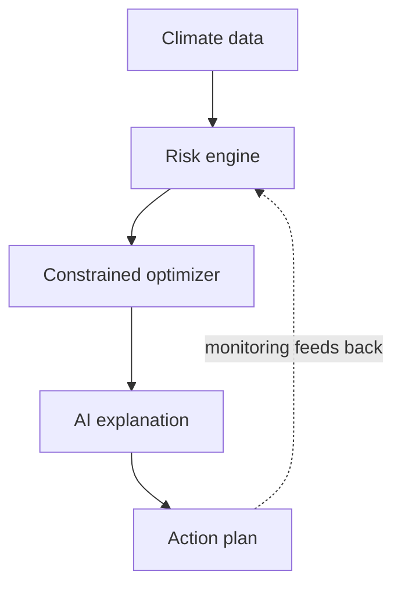

# Climora

**Intelligent Climate Adaptation Platform — from climate risk to an implementable adaptation plan.**

> Climora doesn't stop at showing a city where climate risk exists. It determines what can be done about it, where, at what cost, how the plan changes under different budgets and futures, and why the system recommends it — with a human planner making the final call at every step.

---

## What it does

A planner (municipal authority, disaster-management officer, urban planner) opens the GIS Decision Center for their city and:

1. **Sees localized climate risk** — hazard × exposure × vulnerability, computed by the Climate Risk Engine, not asserted by an AI.
2. **Specifies real-world constraints** — budget, land, water, workforce, implementation deadline, planning priority.
3. **Gets a resource-constrained adaptation portfolio** — the Optimizer selects interventions (cool roofs, urban trees, cooling centers, etc.) that fit within hard limits, never violating them.
4. **Explores what-if scenarios** — change the budget, the planning horizon, or the priority, and see how the portfolio changes and why.
5. **Asks the AI Advisor "why"** — "Why was this ward prioritized?", "Why were cool roofs selected over trees?" — answered from the system's own structured outputs, never invented.
6. **Exports an Action Plan** — location, intervention, cost, timeline, responsible department, monitoring indicators.
7. **Monitors implementation** — progress feeds back into reassessment, closing the loop.

---

## Architecture (summary)

```
USER → GIS DECISION CENTER → API / APPLICATION SERVICES
     → DATA INGESTION & PROCESSING
     → CLIMATE RISK ENGINE → EXPOSURE + VULNERABILITY
     → ADAPTATION INTERVENTION ENGINE
     → RESOURCE & CONSTRAINT MANAGER
     → OPTIMIZATION ENGINE ⇄ SCENARIO ENGINE
     → AI EXPLANATION / DECISION SUPPORT
     → ADAPTATION ACTION PLAN → MONITORING ↺ REASSESSMENT
```

**Core principle:** scientific models calculate risk; optimization calculates feasible portfolios under real constraints; scenario engines calculate consequences of changed assumptions; AI explains results; humans decide. AI is never the scientific authority that invents or calculates risk values.

Full architecture: `docs/architecture.md`. ADRs: `docs/decisions.md`.
## Architecture (summary)



**Core principle:** scientific models calculate risk; optimization calculates feasible portfolios under real constraints; AI explains results; humans decide.
---

## Tech stack

| Layer | Choice |
|---|---|
| Frontend | Next.js, TypeScript, Tailwind CSS, MapLibre, Recharts |
| Backend | Python, FastAPI, Pydantic |
| Scientific / geospatial | CLIMADA (reference methodology), GeoPandas, Rasterio, Shapely, NumPy, SciPy |
| Optimization | OR-Tools / PuLP (MILP) |
| Database | PostgreSQL + PostGIS |
| AI | LLM API — explanation/report generation only, never risk computation |
| Infrastructure | Docker |

---

## MVP scope

**Location:** Indore, Madhya Pradesh. **Hazard:** Extreme heat.

The architecture is built for extensibility (flood, drought, water stress, extreme rainfall, multi-city) via a common hazard-engine abstraction, but the MVP intentionally stays narrow — one city, one hazard, a small curated intervention catalog — to keep every number traceable to real or clearly-marked-modeled data.

---

## Repository layout

```
Climora/
├── README.md               ← you are here
├── AGENTS.md               ← context for AI coding agents
├── docs/                   ← full architecture, ADRs, per-domain design docs
│   ├── project-context.md  ← read first
│   ├── architecture.md     ← locked system design
│   ├── decisions.md        ← ADRs — don't relitigate
│   └── ...                 ← climate-risk-engine.md, optimization.md, ai-advisor.md, etc.
├── backend/                ← FastAPI; domain/ organized by the risk→decision chain
├── frontend/                ← Next.js dashboards (risk, planner, scenario, advisor, plan, monitoring)
├── config/                 ← hazards.yaml, interventions.yaml, optimization.yaml, ai.yaml
├── data/                   ← raw/, processed/, boundaries/, artifacts/
├── notebooks/               ← exploratory science + optimization validation
├── scripts/                 ← ingestion, seeding, MVP run scripts
├── tests/                   ← unit, integration, api, geospatial, risk, optimization, scenarios
├── docker/
└── api_testing/
```

---

## Quickstart (after implementation lands)

```bash
git clone <repo>
cd Climora
cd backend && pip install -r requirements.txt && cd ..
cd frontend && npm install && cd ..

# every session
cd backend && uvicorn main:app --host 127.0.0.1 --port 8000   # terminal 1
cd frontend && npm run dev                                    # terminal 2

# verify
curl http://127.0.0.1:8000/api/v1/health
```

Full deployment details: `docs/deployment.md`.

---

## Data integrity

Every derived value — risk, exposure, vulnerability, cost, effectiveness — is tagged `REAL`, `MODELED`, or `DEMO` and traceable back through `dataset → processing → model → output` via the Provenance Tracker. Nothing is fabricated; where real data is unavailable, the gap is shown, not filled in silently. See `docs/data-provenance.md`.

---
## Status

| Phase | State |
|---|---|
| Phase 1 — Architecture | Drafted |
| Phase 2 — Tech/model selection | Drafted |
| Phase 3 — Documentation | In progress |
| Phase 4 — Implementation | Not started |

"Drafted" means the design in `docs/architecture.md` is written and internally consistent — not that it's been reviewed, tested, or frozen. Treat it as a starting point to challenge, not a locked spec.
---

## Reading order

If you're new to this codebase:

1. `AGENTS.md` — if you're an AI session, or skip to step 2 if you're a human.
2. `docs/project-context.md` — start here, always.
3. `docs/requirements.md` — MVP scope, Indore/heat boundary.
4. `docs/architecture.md` — the locked system design.
5. `docs/decisions.md` — why it's built this way (don't relitigate).
6. Everything else, as needed for the task at hand.

If you're contributing: **never commit directly to `main`.** Branch → implement → test → review diff → commit → push → PR. See `AGENTS.md` §Git boundary for the exact rule when an AI coding agent is doing the implementing.

---

## License

TBD by the team.
