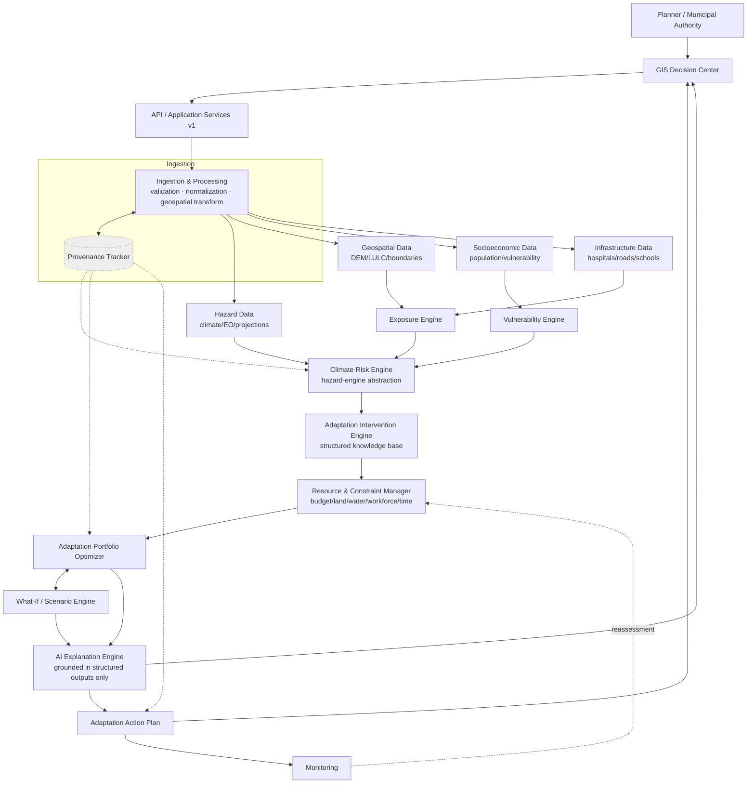

# Climora — Intelligent Climate Adaptation Platform

**System Architecture — "From Climate Risk to an Implementable Adaptation Plan"**

> Engineering quality bar: Bulwark (structural reference only — no domain overlap).
> Domain: original, climate-adaptation-specific.

---

## 1. Architecture Summary

Climora is a decision-support platform, not a mapping tool. It takes a city (MVP: Indore, extreme heat) through a fixed computational chain:

```
DATA → SCIENCE (hazard/exposure/vulnerability → risk) → INTERVENTION CATALOG
     → RESOURCE-CONSTRAINED OPTIMIZATION → SCENARIO EXPLORATION
     → AI EXPLANATION → HUMAN DECISION → ACTION PLAN → MONITORING → REASSESSMENT
```

Three architectural commitments make the rest of the design fall out cleanly:

1. **AI is downstream of science, never upstream of it.** The AI Advisor consumes structured outputs from the Risk Engine and Optimizer; it never computes risk or invents effectiveness numbers.
2. **Optimization is constraint-first.** The Resource & Constraint Manager defines hard limits (budget, land, water, workforce, time) that the Optimizer *cannot* violate — this is enforced structurally, the same way Bulwark's Policy gate cannot be bypassed by the Orchestrator.
3. **Every number is traceable.** Real data, modeled data, and demo data are tagged and carried through the whole pipeline via provenance records — nothing silently becomes "just a number" by the time it reaches a dashboard.

The differentiator is the **integrated workflow** (risk → constraints → optimized portfolio → scenario comparison → explanation → plan → monitoring), not any single algorithm.

---

## 2. System Architecture

### Logical layers (top to bottom)

```
USERS / PLANNING AUTHORITY
        ↓
GIS DECISION CENTER  (dashboards: risk, planner, budget simulator, scenario, AI advisor, action plan, monitoring)
        ↓
API / APPLICATION SERVICES  (versioned REST, thin routers)
        ↓
DATA INGESTION & PROCESSING  (validation, normalization, geospatial transforms, provenance tagging)
        ↓
CLIMATE RISK ENGINE  (hazard × exposure × vulnerability → risk)
        ↓
EXPOSURE ENGINE  +  VULNERABILITY ENGINE   (feed the Risk Engine; independently queryable)
        ↓
ADAPTATION INTERVENTION ENGINE  (structured intervention knowledge base)
        ↓
RESOURCE & CONSTRAINT MANAGER  (budget/land/water/workforce/time — hard limits)
        ↓
ADAPTATION PORTFOLIO OPTIMIZER  ⇄  SCENARIO ENGINE  (bidirectional: scenarios re-run the optimizer)
        ↓
AI EXPLANATION / DECISION-SUPPORT ENGINE  (explains, never calculates risk)
        ↓
ADAPTATION ACTION PLAN
        ↓
MONITORING  ↺  feeds back into REASSESSMENT → OPTIMIZATION → UPDATED PLAN
```

### Mermaid component diagram



### Responsibilities and boundaries

| Component | Responsible for | NOT responsible for |
|---|---|---|
| GIS Decision Center | Map layers, dashboards, user interaction, triggering plan generation | Running models, optimization, or AI inference client-side |
| API / Application Services | Request validation, routing to domain services, response shaping | Business logic, scientific computation |
| Ingestion & Processing | Validating, normalizing, geospatially transforming raw datasets; tagging provenance at entry | Deciding hazard thresholds or scientific methodology |
| Climate Risk Engine | Combining hazard + exposure + vulnerability into risk/impact per the hazard-engine abstraction | Recommending interventions |
| Exposure Engine | Spatial exposure of population/assets to a hazard | Vulnerability scoring |
| Vulnerability Engine | Deriving/holding vulnerability & adaptive-capacity indicators | Fabricating values where real data is absent (must mark DEMO/MODELED) |
| Adaptation Intervention Engine | Structured catalog of interventions with cost/resource/effectiveness metadata | Selecting *which* interventions to deploy |
| Resource & Constraint Manager | Defining and enforcing hard resource limits and priorities | Running the optimization itself |
| Adaptation Portfolio Optimizer | Selecting a feasible, objective-driven intervention portfolio | Explaining *why* in natural language |
| Scenario Engine | Re-running the optimizer under changed assumptions (budget/year/priority) | Storing the "current" plan (Action Plan owns that) |
| AI Explanation Engine | Explaining results, trade-offs, answering planner questions, drafting report text | Calculating risk, cost, or effectiveness values |
| Action Plan | Structured, implementable output: location, intervention, cost, timeline, owner, monitoring indicators | Optimization logic |
| Monitoring | Tracking implementation progress and feeding it back into reassessment | Re-deriving risk from scratch (calls back into Risk Engine) |
| Provenance Tracker (cross-cutting) | dataset → processing → model → output traceability, real/modeled/demo tagging | Any domain computation |

---

## 3. Detailed Component Breakdown

**Climate Risk Engine** — hazard-engine abstraction: a common interface (`compute_risk(hazard_layer, exposure_layer, vulnerability_layer, config) -> RiskLayer`) implemented once for Extreme Heat (MVP) so Flood/Drought/Water-Stress/Rainfall engines can be added later without touching the API, Optimizer, or AI layers. Built on CLIMADA/Rasterio/GeoPandas concepts referenced, not reinvented.

**Exposure Engine** — computes what's spatially exposed (population counts, buildings, roads, hospitals, schools, critical infrastructure, environmental assets) per ward/grid cell, independent of any one hazard so it's reusable across future hazard engines.

**Vulnerability Engine** — derives population/socioeconomic/infrastructure/environmental vulnerability and adaptive-capacity indicators from socioeconomic + demographic datasets. Every derived (non-measured) indicator is flagged `MODELED`.

**Adaptation Intervention Engine** — a structured catalog (not free text) where each intervention record carries: id, name, hazard, target asset, suitable location type, estimated cost, land/water/workforce requirement, implementation duration, maintenance requirement, modeled effectiveness, affected-population estimate, assumptions, evidence/source. MVP catalog: cool roofs, urban trees, cooling centers, shaded public spaces, heat early-warning systems. Flood/water interventions are schema-compatible but out of MVP scope.

**Resource & Constraint Manager** — holds hard constraints (budget, land, water, workforce, time, implementation capacity) and soft priorities (protect vulnerable population, minimize cost, etc.) as first-class objects the Optimizer must query, not parameters buried in optimizer code. This is the structural analogue of Bulwark's Policy gate: the Optimizer *cannot* emit a portfolio that violates a hard constraint — that check happens outside the optimization call, on the returned portfolio, before it's persisted.

**Adaptation Portfolio Optimizer** — takes risk + exposure + vulnerability + intervention catalog + constraints + an explicit objective (maximize risk reduction / maximize vulnerable-population protection / maximize infrastructure protection / minimize cost / balanced weighted objective) and returns a portfolio: interventions × locations × quantities × costs × resource consumption × modeled risk reduction × population/infrastructure protected. Multi-objective trade-offs are returned as explicit numbers (a Pareto-style comparison), never collapsed into one unexplained "AI score."

**Scenario Engine** — re-invokes the Optimizer with modified inputs (budget, climate year/scenario, resource availability, objective, priority, intervention assumptions) and diffs the resulting portfolios against a baseline, surfacing what changed and why (which constraint became binding, which intervention dropped out).

**AI Explanation Engine** — takes the Optimizer's and Risk Engine's structured outputs (never raw model weights, never re-deriving numbers) and answers planner questions ("Why was this ward prioritized?", "Why were cool roofs selected?", "What changes if budget drops to ₹2 crore?") by referencing those outputs directly, and drafts natural-language report sections for the Action Plan.

**GIS Decision Center** — the single visual interface: layered map (risk/exposure/vulnerability/population/infrastructure/vegetation/interventions/implementation status), ward click-through, plan generation trigger, budget/scenario controls, scenario comparison view, AI advisor chat panel.

**Action Plan** — the implementable output: per intervention — priority location, quantity, cost, resource requirements, timeline, expected modeled impact, responsible department, monitoring indicators, assumptions. Rendered as a document artifact (PDF/DOCX) and stored as structured rows, not just prose.

**Monitoring** — tracks implementation progress, budget utilization, completion status, and (where available) updated risk/exposure, closing the loop: `MONITORING → REASSESSMENT → OPTIMIZATION → UPDATED PLAN`.

**Provenance Tracker (cross-cutting)** — every dataset carries source/timestamp/version/spatial & temporal resolution/processing status; every derived output carries a chain back to the datasets and model version that produced it; every value is tagged `REAL` / `MODELED` / `DEMO`.

---

## 4. Complete Repository Tree

```
Climora/
├── README.md
├── AGENTS.md
├── docs/
│   ├── README.md
│   ├── project-context.md
│   ├── architecture.md
│   ├── decisions.md
│   ├── requirements.md
│   ├── data-model.md
│   ├── data-sources.md
│   ├── climate-risk-engine.md
│   ├── geospatial.md
│   ├── exposure.md
│   ├── vulnerability.md
│   ├── interventions.md
│   ├── optimization.md
│   ├── scenarios.md
│   ├── ai-advisor.md
│   ├── api.md
│   ├── backend.md
│   ├── frontend.md
│   ├── database.md
│   ├── testing.md
│   ├── deployment.md
│   ├── data-provenance.md
│   ├── model-validation.md
│   ├── implementation-plan.md
│   ├── demo.md
│   └── AI-CONTEXT.md
├── backend/
│   ├── main.py
│   ├── config.py
│   ├── requirements.txt
│   ├── .env.example
│   ├── api/
│   │   ├── v1/
│   │   │   ├── health.py
│   │   │   ├── risk.py
│   │   │   ├── exposure.py
│   │   │   ├── vulnerability.py
│   │   │   ├── interventions.py
│   │   │   ├── resources.py
│   │   │   ├── optimization.py
│   │   │   ├── scenarios.py
│   │   │   ├── recommendations.py
│   │   │   ├── ai.py
│   │   │   ├── reports.py
│   │   │   └── monitoring.py
│   ├── domain/
│   │   ├── climate/
│   │   │   ├── hazard_loader.py
│   │   │   └── projections.py
│   │   ├── geospatial/
│   │   │   ├── raster_ops.py
│   │   │   ├── vector_ops.py
│   │   │   └── spatial_join.py
│   │   ├── risk_engine/
│   │   │   ├── base_hazard_engine.py       # abstraction all hazard engines implement
│   │   │   ├── heat_risk_engine.py         # MVP
│   │   │   ├── flood_risk_engine.py        # future, stubbed
│   │   │   └── risk_composer.py            # hazard × exposure × vulnerability
│   │   ├── exposure/
│   │   │   └── exposure_engine.py
│   │   ├── vulnerability/
│   │   │   └── vulnerability_engine.py
│   │   ├── interventions/
│   │   │   ├── catalog.py
│   │   │   └── schema.py
│   │   ├── resource_manager/
│   │   │   ├── constraints.py
│   │   │   └── priorities.py
│   │   ├── optimization/
│   │   │   ├── optimizer.py
│   │   │   ├── objectives.py
│   │   │   └── constraint_validator.py     # rejects any portfolio violating hard limits
│   │   ├── scenarios/
│   │   │   └── scenario_engine.py
│   │   ├── ai_advisor/
│   │   │   ├── explainer.py
│   │   │   ├── prompt_builder.py           # builds prompts strictly from structured outputs
│   │   │   └── report_generator.py
│   │   ├── monitoring/
│   │   │   └── tracker.py
│   │   └── provenance/
│   │       └── tracker.py                  # single write path for provenance records
│   ├── services/
│   │   ├── ingestion_service.py
│   │   ├── validation_service.py
│   │   └── plan_service.py
│   ├── repositories/
│   │   ├── datasets.py
│   │   ├── risk_assessments.py
│   │   ├── interventions.py
│   │   ├── optimization_runs.py
│   │   ├── scenarios.py
│   │   ├── plans.py
│   │   ├── monitoring.py
│   │   └── provenance.py
│   ├── models/
│   │   └── schemas.py
│   └── utils/
│       ├── ids.py
│       └── paths.py
├── frontend/
│   ├── src/
│   │   ├── App.tsx
│   │   ├── pages/
│   │   │   ├── RiskDashboard.tsx
│   │   │   ├── AdaptationPlanner.tsx
│   │   │   ├── BudgetSimulator.tsx
│   │   │   ├── ScenarioSimulator.tsx
│   │   │   ├── AiAdvisor.tsx
│   │   │   ├── ActionPlan.tsx
│   │   │   └── Monitoring.tsx
│   │   ├── components/
│   │   │   ├── map/
│   │   │   │   ├── GisMap.tsx              # MapLibre
│   │   │   │   ├── LayerToggle.tsx
│   │   │   │   └── WardInspector.tsx
│   │   │   ├── charts/
│   │   │   │   └── RiskChart.tsx           # Recharts
│   │   │   ├── planner/
│   │   │   │   ├── ConstraintForm.tsx
│   │   │   │   └── PortfolioTable.tsx
│   │   │   ├── scenario/
│   │   │   │   └── ScenarioCompare.tsx
│   │   │   └── advisor/
│   │   │       └── AdvisorChat.tsx
│   │   ├── hooks/
│   │   │   ├── useRisk.ts
│   │   │   ├── useOptimization.ts
│   │   │   └── useScenario.ts
│   │   └── services/
│   │       └── api.ts                      # one function per api.md endpoint
│   ├── package.json
│   └── vite.config.ts / next.config.js
├── config/
│   ├── app.yaml
│   ├── hazards.yaml                        # thresholds per hazard
│   ├── interventions.yaml                  # default cost/resource assumptions
│   ├── optimization.yaml                   # objective weights, solver settings
│   ├── data_sources.yaml
│   └── ai.yaml
├── data/
│   ├── raw/
│   ├── processed/
│   ├── boundaries/
│   └── artifacts/                          # generated reports/plans
├── notebooks/
│   ├── heat_risk_exploration.ipynb
│   └── optimization_validation.ipynb
├── scripts/
│   ├── ingest_indore_boundaries.py
│   ├── run_heat_risk_mvp.py
│   └── seed_intervention_catalog.py
├── tests/
│   ├── unit/
│   ├── integration/
│   ├── api/
│   ├── geospatial/
│   ├── risk/
│   ├── optimization/
│   ├── scenarios/
│   └── fixtures/
├── docker/
│   ├── backend.Dockerfile
│   ├── frontend.Dockerfile
│   └── docker-compose.yml
└── api_testing/
    ├── postman_collection.json
    └── sample_requests/
```

Every folder above exists for a Climora-specific reason — none is a renamed Bulwark folder. `risk_engine/base_hazard_engine.py` is the one deliberate structural echo of Bulwark's "extend without rewriting" discipline (its capability-registry pattern), applied to hazards instead of tools.

---

## 5. Backend Domain Architecture

`backend/domain/` is organized around the computational chain, not around generic CRUD:

| Module | Responsibility | Depends on |
|---|---|---|
| `climate/` | Load hazard/climate projection data | `geospatial/`, ingestion |
| `geospatial/` | Raster/vector ops, spatial joins (GeoPandas/Rasterio/Shapely) | — |
| `risk_engine/` | Hazard-engine abstraction + heat (MVP) + risk composition | `climate/`, `exposure/`, `vulnerability/` |
| `exposure/` | Spatial exposure computation | `geospatial/` |
| `vulnerability/` | Vulnerability/adaptive-capacity indicators | socioeconomic data |
| `interventions/` | Structured intervention catalog | — |
| `resource_manager/` | Hard constraints + soft priorities as queryable objects | — |
| `optimization/` | Portfolio optimizer + constraint validator (hard gate on output) | `interventions/`, `resource_manager/`, `risk_engine/` |
| `scenarios/` | Re-runs optimizer under changed assumptions, diffs results | `optimization/` |
| `ai_advisor/` | Explanation/report generation grounded in structured outputs | `optimization/`, `risk_engine/`, `scenarios/` |
| `monitoring/` | Implementation tracking, reassessment trigger | `plans` repository |
| `provenance/` | Single write path for dataset→process→model→output lineage | called by every module above |

**Structural rule, mirroring Bulwark's Orchestrator/Policy split:** `optimization/optimizer.py` proposes a portfolio; `optimization/constraint_validator.py` is the only path by which a portfolio is persisted or returned to the API — a portfolio that fails validation is rejected and logged, never silently clamped or fixed up. This is what makes "the optimizer must not recommend interventions that violate hard constraints" a structural guarantee rather than a convention.

`api/` stays thin — routers validate the request, call one `domain/` or `services/` function, return. No business logic in `api/`.

---

## 6. Frontend Architecture

Next.js + TypeScript + Tailwind + MapLibre + Recharts.

**Hard rule (mirrors Bulwark's frontend boundary):** the frontend never runs scientific models or optimization client-side. Every risk value, portfolio, and explanation comes from the API. `services/api.ts` is the only place `fetch` is called.

| Page | Purpose | Talks to |
|---|---|---|
| `RiskDashboard` | Layered GIS view: hazard/exposure/vulnerability/risk | `/api/v1/risk`, `/api/v1/exposure`, `/api/v1/vulnerability` |
| `AdaptationPlanner` | Constraint form → triggers optimization | `/api/v1/resources`, `/api/v1/optimization` |
| `BudgetSimulator` | Adjust budget, see portfolio change live | `/api/v1/optimization`, `/api/v1/scenarios` |
| `ScenarioSimulator` | Side-by-side scenario comparison (2030 vs 2050, ₹2cr vs ₹5cr) | `/api/v1/scenarios` |
| `AiAdvisor` | Chat grounded in the current Job's structured outputs | `/api/v1/ai` |
| `ActionPlan` | Structured plan view + export | `/api/v1/reports` |
| `Monitoring` | Implementation progress, triggers reassessment | `/api/v1/monitoring` |

`GisMap.tsx` renders MapLibre layers keyed by `LayerToggle`; `WardInspector.tsx` opens a side panel on ward click showing risk/exposure/vulnerability for that ward and a "Generate Plan for this Ward" action.

---

## 7. API Architecture

All endpoints versioned under `/api/v1/`.

| Endpoint | Method | Request | Response | Validates against |
|---|---|---|---|---|
| `/health` | GET | — | `{status: "ok"}` | — |
| `/risk` | GET | `ward_id`, `hazard`, `scenario_year` | risk layer + provenance | risk_assessments schema |
| `/exposure` | GET | `ward_id`, `asset_type` | exposure values | exposure_assets schema |
| `/vulnerability` | GET | `ward_id` | vulnerability indicators (tagged REAL/MODELED) | vulnerability_indicators schema |
| `/interventions` | GET | `hazard` (optional filter) | intervention catalog | interventions schema |
| `/resources` | POST | budget/land/water/workforce/time/priority | constraint set ID | constraints schema |
| `/optimization` | POST | constraint set ID, objective, risk/exposure/vulnerability refs | portfolio | optimization_results schema |
| `/scenarios` | POST | baseline optimization run ID + changed params | diffed portfolios | scenarios schema |
| `/recommendations` | GET | `optimization_run_id` | ranked, explained recommendations | — |
| `/ai` | POST | question + `optimization_run_id`/`scenario_id` context | grounded natural-language answer | ai_queries schema |
| `/reports` | POST | `optimization_run_id` | generated Action Plan artifact | plan_items schema |
| `/monitoring` | GET/POST | `plan_id` | progress records; triggers reassessment | monitoring_records schema |

Every response payload includes a `provenance` block (`dataset_ids`, `model_version`, `data_class: REAL|MODELED|DEMO`). Validation errors return `400` with a structured `{field, reason}` list; constraint violations from the optimizer return `422` with the specific violated constraint named — never a generic "invalid request."

---

## 8. Database Architecture (PostgreSQL + PostGIS)

```
users                    — planner accounts, roles
locations, boundaries     — ward/city geometries (PostGIS geometry columns)
datasets, dataset_versions — provenance-tracked raw/processed data
hazards                   — hazard definitions + thresholds (config-backed)
risk_assessments          — computed risk layers, keyed to hazard+location+scenario_year
exposure_assets           — population/building/road/hospital/school exposure per location
vulnerability_indicators  — derived indicators, tagged REAL/MODELED
interventions             — catalog entries (cost/resource/effectiveness/assumptions)
intervention_costs        — versioned cost assumptions (can change without code change)
resources                 — available resource pools per planning run
constraints               — hard limits for a given optimization run
optimization_runs         — run metadata: objective, constraint_set_id, timestamp
optimization_results      — selected portfolio: intervention × location × quantity × cost
scenarios                 — scenario definitions (changed params vs a baseline run)
adaptation_plans          — one plan per accepted optimization/scenario result
plan_items                — per-intervention plan rows: location, cost, timeline, owner
monitoring_indicators     — what's tracked per plan item
monitoring_records        — time-series progress against each indicator
ai_queries                — logged advisor Q&A, with the structured context it was grounded in
provenance_records        — dataset → processing → model → output lineage, single source of truth
```

`risk_assessments`, `optimization_results`, and `vulnerability_indicators` all carry a `data_class` enum (`REAL`/`MODELED`/`DEMO`) and a `dataset_version_id` foreign key — no computed value exists without a traceable origin.

---

## 9. Data Flow

```
Raw dataset (climate/geospatial/socioeconomic/infrastructure)
    → Ingestion (validate, normalize, reproject)
    → Provenance record created (source, version, resolution, status)
    → Processed dataset stored, versioned
    → Exposure Engine + Vulnerability Engine read processed data
    → Risk Engine composes hazard × exposure × vulnerability → risk_assessments row
    → Available via /api/v1/risk, /exposure, /vulnerability, each carrying provenance
```

## 10. Optimization Flow

```
Planner submits constraints (POST /resources) → constraints row created
Planner triggers optimization (POST /optimization) with objective + risk/exposure/vulnerability refs
    → Optimizer proposes portfolio using intervention catalog + constraints
    → Constraint Validator checks: no hard limit violated, no negative costs, resource sums ≤ availability
        → fail: rejected, logged, 422 returned with violated constraint named
        → pass: optimization_results persisted, optimization_run marked complete
    → Result available via /recommendations and to the AI Explanation Engine
```

## 11. Scenario Flow

```
Planner picks a baseline optimization_run_id
Planner changes one or more params (budget / year / resource availability / objective / priority)
    → Scenario Engine creates a new optimization_run with those params
    → Optimizer + Constraint Validator run again (same path as §10)
    → Scenario Engine diffs new portfolio vs baseline: added/dropped interventions, cost delta,
      risk-reduction delta, which constraint became binding
    → Diffed result returned via /scenarios, rendered in ScenarioSimulator
```

## 12. AI Advisor Flow

```
Planner asks a question via AiAdvisor, scoped to an optimization_run_id / scenario_id
    → prompt_builder.py assembles context ONLY from structured DB rows for that run:
      risk_assessments, optimization_results, constraints, scenario diff (if any)
    → LLM call (explanation only — no computation) produces grounded natural-language answer
    → Answer + the exact structured context used are both logged to ai_queries
    → If the question requires a number not present in the structured context,
      the advisor states that it cannot compute that value rather than estimating it
```

## 13. Data Provenance Flow

```
Dataset ingested → provenance_records row: {dataset_id, source, timestamp, version,
    spatial_resolution, temporal_resolution, processing_status}
Every derived output (risk_assessments, vulnerability_indicators, optimization_results)
    references the provenance_record(s) of everything it was computed from
Every API response includes: {data_class: REAL|MODELED|DEMO, dataset_version_ids, model_version}
Nothing enters a dashboard or a plan without a traceable chain: dataset → processing → model → output
```

## 14. Security / Reliability Boundaries

| Boundary | Purpose |
|---|---|
| Auth + role-based access | Distinguish planner / department roles for who can trigger optimization or edit constraints — not decorative, since a bad optimization run has real budget consequences |
| API input validation (Pydantic) | Reject malformed geometry, negative budgets, impossible dates before they reach domain logic |
| Constraint Validator (structural, not just API-level) | Optimizer output cannot bypass hard-limit checks — same non-bypassable-gate pattern as Bulwark's Policy layer |
| Dataset/model versioning | Any risk or optimization result is reproducible against the exact dataset/model version used |
| Provenance auditability | Every value in a plan can be traced back; supports both debugging and planner trust |
| Logging | Structured logs per API call and per optimization run, not decorative "enterprise" logging |
| Error handling | Domain exceptions (`ConstraintViolationError`, `ProvenanceMissingError`) map to specific HTTP error shapes, never a bare 500 |

No microservices, no Kafka, no Kubernetes, no blockchain — a single FastAPI backend, single PostGIS database, and a job-less synchronous request/response model are sufficient at this scale; nothing here needs event-driven infrastructure to be correct.

---

## 15. Architecture → Repository Mapping

| Architecture Component | Repository Location | Responsibility | Main Technology | Inputs | Outputs |
|---|---|---|---|---|---|
| Climate Risk Engine | `backend/domain/risk_engine/` | Hazard × exposure × vulnerability → risk | CLIMADA concepts + Python | hazard/exposure/vulnerability layers | risk layers |
| Exposure Engine | `backend/domain/exposure/` | Spatial exposure computation | GeoPandas/Rasterio | population/asset + geospatial data | exposure_assets rows |
| Vulnerability Engine | `backend/domain/vulnerability/` | Vulnerability indicators | Pandas/GeoPandas | socioeconomic data | vulnerability_indicators rows |
| Adaptation Intervention Engine | `backend/domain/interventions/` | Structured intervention catalog | Pydantic + Postgres | curated intervention data | intervention records |
| Resource & Constraint Manager | `backend/domain/resource_manager/` | Hard/soft constraint objects | Pydantic | planner input | constraints rows |
| Portfolio Optimizer | `backend/domain/optimization/` | Constrained portfolio selection | OR-Tools/PuLP | risk+catalog+constraints | optimization_results |
| Scenario Engine | `backend/domain/scenarios/` | Re-run + diff under changed params | Python | baseline run + changed params | scenario diff |
| AI Explanation Engine | `backend/domain/ai_advisor/` | Explain, don't compute | LLM API | structured outputs only | grounded answers/report text |
| GIS Decision Center | `frontend/src/pages/`, `frontend/src/components/map/` | Visual interaction | Next.js + MapLibre | API responses | user actions |
| Action Plan | `backend/domain/monitoring/` (generation), `data/artifacts/` (output) | Structured implementable plan | python-docx/reportlab | optimization_results | plan documents |
| Monitoring | `backend/domain/monitoring/` | Progress tracking, reassessment trigger | Python | plan_items + field updates | monitoring_records |
| Provenance Tracker | `backend/domain/provenance/` | Lineage, single write path | Postgres | every domain write | provenance_records |

---

## 16. MVP vs Future Architecture

**MVP — MUST BUILD**
- One city (Indore), Extreme Heat only
- Heat Risk Engine (hazard × exposure × vulnerability, real available data + clearly marked modeled fill-ins)
- Intervention catalog: cool roofs, urban trees, cooling centers, shaded public spaces, heat early-warning systems
- Resource & Constraint Manager: budget, land, workforce, time (water optional for heat MVP)
- Single-objective + one balanced-objective optimizer (OR-Tools or PuLP, linear/MILP)
- Scenario comparison: budget variants + one future year
- AI Advisor answering grounded questions from structured outputs
- GIS dashboard: risk/exposure/vulnerability layers + ward inspector
- Action Plan export (structured + one document format)

**MVP — SIMPLIFIED**
- Vulnerability indicators: a small, clearly-marked-modeled set, not a full socioeconomic model
- Optimizer: MILP over a small intervention set, not full multi-objective Pareto search
- Monitoring: manual progress entry, not automated feeds
- Dataset coverage: Indore only, a handful of curated layers

**FUTURE EXTENSION**
- Flood / Drought / Water-Stress / Extreme-Rainfall risk engines (via the existing hazard-engine abstraction)
- Multi-city support
- Real-time data feeds, automated monitoring
- Full multi-objective optimization with Pareto frontier UI
- Digital-twin-style continuous reassessment

---

## 17. 3-Day Implementation Plan

**Day 1 — Foundations**
Repo scaffold, config loading, PostGIS schema + migrations, Indore boundary ingestion, provenance write path, health check. (Backend + frontend scaffolds can proceed in parallel.)

**Day 2 — Science + Optimization**
Heat Risk Engine (hazard-engine abstraction + heat implementation), Exposure Engine, Vulnerability Engine (clearly marked modeled indicators), Intervention catalog seeded, Resource & Constraint Manager, Optimizer + Constraint Validator wired end-to-end against Indore data.

**Day 3 — Decision Layer + Demo**
Scenario Engine (budget + year variants), AI Advisor grounded on structured outputs, GIS dashboard (risk layers, ward inspector, planner form, scenario compare, advisor chat), Action Plan export, end-to-end rehearsal of: risk view → constrained plan → scenario compare → AI explanation → exported plan.

---

## 18. Final Architecture Diagram

*(see §2 for the full Mermaid diagram — reproduced here as the canonical reference)*

```
USER
 ↓
GIS DECISION CENTER
 ↓
API / APPLICATION SERVICES
 ↓
DATA INGESTION & PROCESSING  ←→  [provenance | validation | logging]  (cross-cutting)
 ↓
CLIMATE RISK ENGINE
 ↓
EXPOSURE + VULNERABILITY
 ↓
ADAPTATION INTERVENTION ENGINE
 ↓
RESOURCE & CONSTRAINT MANAGER
 ↓
OPTIMIZATION ENGINE  ⇄  SCENARIO ENGINE
 ↓
AI EXPLANATION / DECISION SUPPORT  ←→  [model versioning | dataset versioning | uncertainty]
 ↓
ADAPTATION ACTION PLAN
 ↓
MONITORING
 ↺ REASSESSMENT
```

## 19. Final Repository Tree Diagram

*(condensed — full detail in §4)*

```
Climora/
├── docs/                 ← architecture, ADRs, per-domain design docs
├── backend/
│   ├── api/v1/           ← thin routers
│   ├── domain/           ← climate, geospatial, risk_engine, exposure, vulnerability,
│   │                        interventions, resource_manager, optimization, scenarios,
│   │                        ai_advisor, monitoring, provenance
│   ├── repositories/     ← Postgres/PostGIS access
│   └── models/schemas.py
├── frontend/             ← Next.js dashboards (risk, planner, scenario, advisor, plan, monitoring)
├── config/               ← hazards.yaml, interventions.yaml, optimization.yaml, ai.yaml
├── data/                 ← raw/, processed/, boundaries/, artifacts/
├── tests/                ← unit, integration, api, geospatial, risk, optimization, scenarios
├── docker/
└── api_testing/
```

---

## 20. Architectural Decisions (ADRs)

| ADR | Decision | Rationale | Trade-off accepted |
|---|---|---|---|
| ADR-01 | Single hazard-engine abstraction, one MVP implementation (heat) | New hazards added without rewriting Risk Engine, Optimizer, or API | More upfront interface design before any hazard ships |
| ADR-02 | Constraint validation as a separate, non-bypassable step from optimization | Guarantees hard limits are structurally enforced, not just conventionally respected | Optimizer runs cannot "helpfully" round or fudge a near-miss result |
| ADR-03 | AI Advisor reads only structured DB rows, never raw model internals | Prevents hallucinated risk/cost/effectiveness numbers | Advisor must decline questions the structured data can't answer |
| ADR-04 | PostgreSQL + PostGIS over a NoSQL/graph store | Native geospatial types, mature GIS tooling, single well-understood store | No document-store flexibility for loosely-structured intervention metadata (handled via JSONB columns instead) |
| ADR-05 | OR-Tools/PuLP (MILP) over a bespoke heuristic optimizer | Solver correctness/guarantees are well-established; easier to reason about constraint satisfaction | Less flexible for very large combinatorial scenario spaces (acceptable at city-ward scale) |
| ADR-06 | REAL / MODELED / DEMO tagging on every derived value | Prevents demo data from being mistaken for real risk figures by a planner or a judge | Extra schema and API-payload overhead throughout |
| ADR-07 | Next.js/TypeScript frontend that never runs models client-side | Keeps all scientific/optimization logic auditable in one backend | Slightly more network round-trips for interactive scenario exploration |
| ADR-08 | Synchronous request/response, no message queue | Matches MVP scale (one city, one hazard); avoids infrastructure the team can't operate reliably in 3 days | No async job progress UI for long-running optimizations (mitigated by keeping solves fast at MVP scale) |

---

## 21. Reading Order for a New Developer

1. `README.md` — orientation.
2. `docs/project-context.md` — the one-paragraph mission, read first always.
3. `docs/requirements.md` — MVP scope, Indore/heat boundary.
4. `docs/architecture.md` — this document.
5. `docs/decisions.md` — ADRs; don't relitigate.
6. `docs/climate-risk-engine.md` → `docs/exposure.md` → `docs/vulnerability.md` — the science layer, in dependency order.
7. `docs/interventions.md` → `docs/optimization.md` → `docs/scenarios.md` — the decision layer.
8. `docs/ai-advisor.md` — how explanation is grounded.
9. `docs/api.md`, `docs/backend.md`, `docs/frontend.md`, `docs/database.md` — implementation contracts.
10. `docs/data-provenance.md`, `docs/model-validation.md` — integrity guarantees.
11. `docs/testing.md`, `docs/implementation-plan.md`, `docs/demo.md` — how it's verified and how it's shown.

---

## 22. Why This Architecture

The architecture makes one thing structurally impossible to fake: an AI-generated adaptation plan that isn't traceable back to real data and real constraints. Every layer exists to preserve that guarantee — the hazard-engine abstraction keeps science extensible without touching decision logic; the constraint validator keeps the optimizer honest the same way Bulwark's Policy gate keeps its Orchestrator honest; the provenance tracker keeps every dashboard number accountable to a dataset and a model version; and the AI Explanation Engine is deliberately positioned *after* all of that, so it can only explain what already exists, never invent what's missing. The result is not "an AI that plans cities" — it's a decision-support system that turns climate risk into a resource-aware, explainable, implementable plan, with a human planner making the final call at every step.
